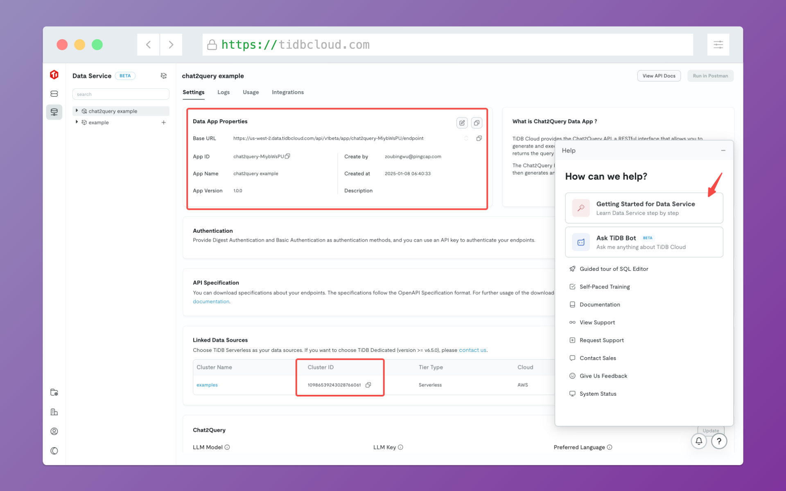

# TiDB Cloud Chat2Query API Example

This example demonstrates how to build an AI-powered SQL chat interface using TiDB Cloud's Chat2Query API. With less than 100 lines of core code, you can create a ChatGPT-like experience for querying your database.

Visit [https://tidbcloud-example-with-chat2query-api.vercel.app/](https://tidbcloud-example-with-chat2query-api.vercel.app/) to experience the demo.

## Getting Started

### Prerequisites

1. Sign up for a [TiDB Cloud](https://tidbcloud.com/) account
2. Create a Serverless Tier cluster (free)
3. Enable Chat2Query feature in your cluster
4. Import sample data into your cluster (optional)

### Configuration

1. First, create a Chat2Query data app in TiDB Cloud console:
  - Go to the "Data Service" section in the right sidebar
  - Click "Create Data App"
  - Make sure to select `Chat2Query Data App` as the data app type


2. Set up the environment variables:
   - Create a `.env` file in this project root
   - Copy your credentials from the data app settings page
   - You'll find the public and private keys in the `Authentication` section when creating an API key



💡 **Pro tip**: Look for the question mark (?) button in the bottom right corner of the TiDB Cloud console - it contains a helpful tutorial for importing sample data and setting up your Chat2Query app!

After sample data is imported, you can copy the database name and put it in the `.env` file for later usage, the `.env` file should look like this:

```env
CHAT2QUERY_BASE_URL=https://xxx.data.tidbcloud.com/api/v1beta/app/chat2query-xxxxx/endpoint
CHAT2QUERY_PUBLIC_KEY=your_public_key
CHAT2QUERY_PRIVATE_KEY=your-private-key-uuid
CHAT2QUERY_CLUSTER_ID=your_cluster_id
CHAT2QUERY_DATABASE=your_database_name
```

### Running the Project

```bash
# Install dependencies
pnpm install

# Start the development server
pnpm run dev
```

Once running, visit `http://localhost:3000` to see your app in action. The app will automatically create a data summary for your database, allowing you to start asking questions in natural language right away!

## Using Chat2Query API

Chat2Query Data App is a collection of APIs that provides a natural language interface to your database. You no longer need to write everything from scratch, you can just ask questions in natural language and get the results using the API.

Let's break down how to use the Chat2Query API step by step:

### 1. Generate Data Summary

First, analyze your database to generate a data summary:

```bash
curl --digest --user ${PUBLIC_KEY}:${PRIVATE_KEY} \
  --request POST 'https://<region>.data.tidbcloud.com/api/v1beta/app/chat2query-<ID>/endpoint/v3/dataSummaries' \
  --header 'content-type: application/json' \
  --data-raw '{
    "cluster_id": "your_cluster_id",
    "database": "your_database",
    "description": "Data summary description",
    "reuse": false
}'
```

This returns a `data_summary_id` and `job_id` that you'll need for the next steps.

### 2. Monitor the Analysis Progress

Check if the data summary generation is complete:

```bash
curl --digest --user ${PUBLIC_KEY}:${PRIVATE_KEY} \
  --request GET 'https://<region>.data.tidbcloud.com/api/v1beta/app/chat2query-<ID>/endpoint/v2/jobs/{job_id}'
```

Wait until the status is "done" before proceeding.

### 3. Start Asking Questions!

Once the data summary is ready, you can ask questions in natural language:

```bash
curl --digest --user ${PUBLIC_KEY}:${PRIVATE_KEY} \
  --request POST 'https://<region>.data.tidbcloud.com/api/v1beta/app/chat2query-<ID>/endpoint/v3/chat2data' \
  --header 'content-type: application/json' \
  --data-raw '{
    "cluster_id": "your_cluster_id",
    "database": "your_database",
    "question": "Show me total sales by region",
    "sql_generate_mode": "direct"
}'
```

The API will:
1. Transform your natural language question into SQL
2. Run the query against your database
3. Return both the SQL query and the results

### Example Response

Here's what you'll get back:

```json
{
  "result": {
    "clarified_task": "Show total sales by region",
    "sql": "SELECT region, SUM(sales) as total_sales FROM sales GROUP BY region",
    "data": {
      "columns": ["region", "total_sales"],
      "rows": [
        ["North", 1234],
        ["South", 5678]
      ]
    }
  }
}
```

For more details, see the [Chat2Query API documentation](https://docs.pingcap.com/tidbcloud/use-chat2query-api).

## Learn More

📚 Helpful resources:

- [Chat2Query Documentation](https://docs.pingcap.com/tidbcloud/chat2query-overview)
- [Chat2Query API Reference](https://docs.pingcap.com/tidbcloud/use-chat2query-api)
- [TiDB Cloud Documentation](https://docs.pingcap.com/tidbcloud)
- [Next.js Documentation](https://nextjs.org/docs)
- [tRPC Documentation](https://trpc.io/docs)

## License

This project is licensed under the MIT License.
