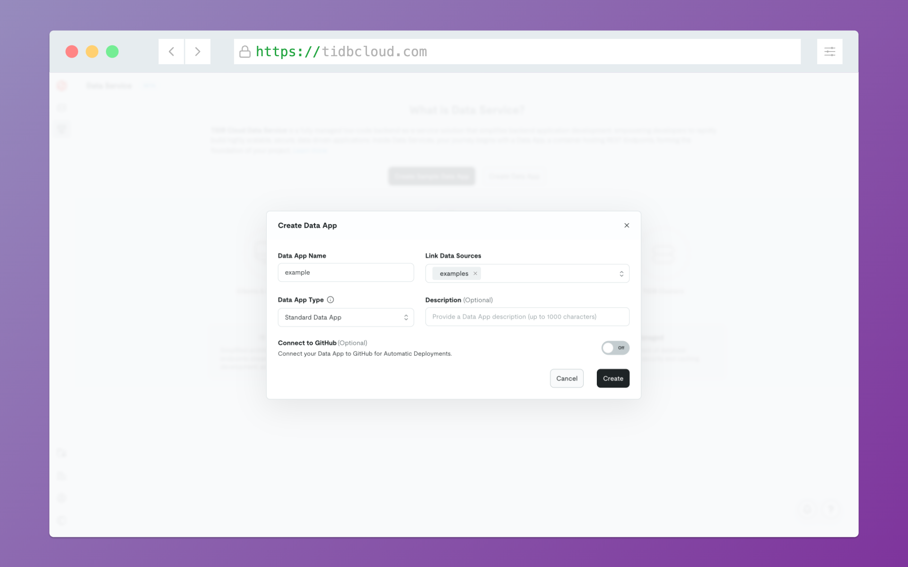

# TiDB Cloud Data Service Guide

A real-time dashboard analyzing car sales trends using Next.js, Chart.js, and TiDB Cloud Data Service.

To begin with, you can refer to the Data Service documentation and try out the online demo to gain familiarity with the platform.

- [Access the Data Service Documentation for more information](https://docs.pingcap.com/tidbcloud/data-service-overview)

## Features

- 📈 Sales volume trends over years
- 💰 Average price trends analysis

## Prepare

### Install the dependencies

```bash
pnpm install
```

### Create a TiDB Cloud Serverless cluster and import data

Head over to [TiDB Cloud](https://tidbcloud.com/), sign in with your Google or GitHub account, and create a new Serverless cluster - **it's completely free and no credit card is required**.

Once your cluster is ready, you'll need to import the sample data. This dataset is about car sales and you can find it in the `dataset` directory.

On your cluster's overview page, click the "Import" tab on the left sidebar to open the data import page. You'll see three options for importing data.


Select "Upload a local file" and upload the `sample_data.sold_car_orders.csv` file from the `dataset` directory. After uploading, we can specify the database and table names as `sample_data` and `sold_car_orders` respectively and then click "Define Table" - the table schema will be automatically inferred. Then click "Start Import" to begin the import process. The import will complete in a few moments.


## Setup API with TiDB Cloud Data Service

Once the data is ready, we can now start building this dashboard app. Our dashboard needs 2 APIs to show different sales insights - yearly volumes and price trends.

Normally, you'd need to build a whole backend server for these APIs - writing code, setting up databases, deploying servers, managing CI/CD, and dealing with maintenance. What a hassle! 😫

But with TiDB Cloud Data Service, you can just write SQL and get an API instantly. No servers to manage, no code to deploy - just SQL to API in seconds. Pretty neat, right?

Let's set these up, go to the data service page by clicking the "Data Service" tab on the left sidebar.


Click the "Create Data App" button to create a new data app and make sure to select the cluster you just created as linked data source.



Then create two endpoints by clicking the plus button on the left top corner. One is for yearly volumes:


<details>

<summary>sql</summary>

```sql
use sample_data;

SELECT
  `year`,
  COUNT(*) AS order_count
FROM
  `sold_car_orders`
GROUP BY
  `year`
ORDER BY
  `year`;
```

</details>

The other is for price trends:


<details>

<summary>sql</summary>

```sql
use sample_data;

SELECT
  `year`,
  AVG(`selling_price`) AS price
FROM
  `sample_data`.`sold_car_orders`
GROUP BY
  `year`
ORDER BY
  `year`;

```

</details>

Set the paths to `/total_order_per_year` and `/avg_price_per_year` in the right side menu - we'll need these exact paths for our frontend requests. Hit the "Run" button to test your endpoints, then "Deploy" to make them live. You'll know they're ready when the gray dots turn green in your endpoint list! 🟢

Now for the auth part - we'll need API keys to make our requests work. Click your data app name, head to "Settings", find "Authentication" and create a new API key.


Grab those keys and save them somewhere safe! Create a `.env` file in the project and add these three lines:

```bash
TIDBCLOUD_DATA_SERVICE_PUBLIC_KEY=PUBLIC_KEY
TIDBCLOUD_DATA_SERVICE_PRIVATE_KEY=PRIVATE_KEY
TIDBCLOUD_DATA_SERVICE_HOST=https://us-east-1.data.tidbcloud.com/api/v1beta/app/dataapi-xxxxxx/endpoint
```

Now we can test the endpoints by using curl, you'll find the curl example in the endpoints properties menu right below the endpoint path setting, then you can copy the command and run it in your terminal, you should also be able to find the data service host url here and don't forget to copy it to the `.env` file:

```bash
curl --digest --user ${PUBLIC_KEY}:${PRIVATE_KEY} --request GET '${YOUR_TIDBCLOUD_DATA_SERVICE_HOST}/avg_price_per_year'
```

## Run the app

Once your APIs are tested and working, and you've got your environment variables in the `.env` file, you're ready to roll! Just run:

```bash
pnpm run dev
```

And boom! 🚀 Your dashboard should spring to life with all those beautiful charts. Head over to http://localhost:3000 to see it in action.
